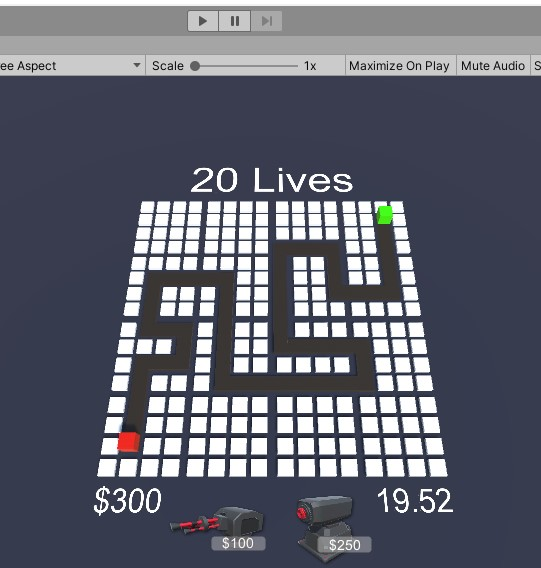
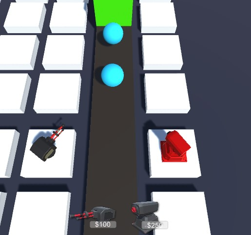
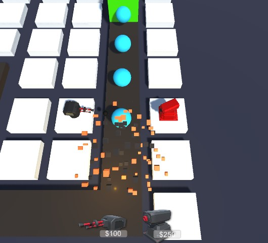
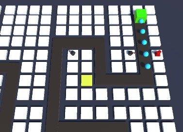
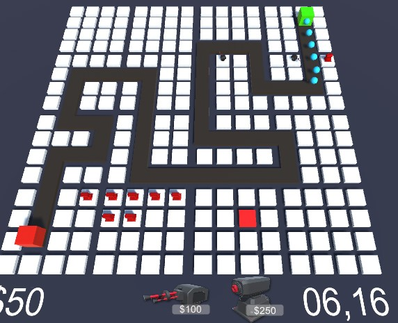

# Zonk-Tower-Defense
A 3D Tower Defence Game using Unity. All code is written entirely in C#.

Inspired by Brackeys @ https://www.youtube.com/c/Brackeys

# Some in-game Screenshots

*how the game looks in Unity before the user initiates the scene.*

*zoomed in to the two types of turrets on the grid and an enemy appears!*

*missile launcher turret particle effects when it hits an enemy*

*tile is yellow color when we hover it in order to build a turret and we have enough money*

*tile is red color when we don't have enough money to buy the selected turret*
